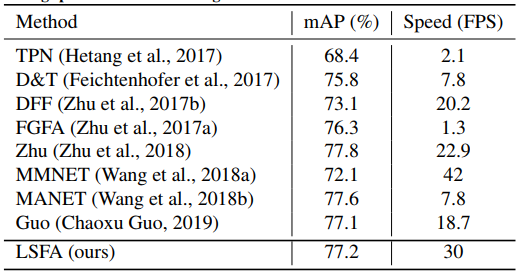

# Real-Time and Accurate Object Detection in Compressed Video by Long Short-term Feature Aggregation

## Introduction
**Real-Time and Accurate Object Detection in Compressed Video by Long Short-term Feature Aggregation**  provides a simple, fast, accurate, and end-to-end framework for video recognition (e.g., object detection and semantic segmentation in videos). It is worth noting that:

* We propose a unified framework LSFA for video object detection addressing both detection accuracy and speed.
* In LSFA, the short-term feature aggregation method is the first work that uses feature extracted from original image to enhance the propagated features for non-key frames.
* On the challenging ImageNet VID dataset, LSFA runs in real-time (30 FPS) with detection accuracy on-par with the state-of-the-art results.


## Main Results


*For fair comparisons, all the values of testing speed are obtained using a Titan X GPU*


## Requirements: Software

1. MXNet from [the offical repository](https://github.com/apache/incubator-mxnet). We tested our code on [MXNet@(commit 75a9e187d)](https://github.com/apache/incubator-mxnet/tree/75a9e187d). 

2. Python 2.7. We recommend using Anaconda2 as it already includes many common packages. We do not suppoort Python 3 yet, if you want to use Python 3 you need to modify the code to make it work.

3. Python packages might missing: cython, opencv-python >= 3.2.0, easydict. If `pip` is set up on your system, those packages should be able to be fetched and installed by running
	```
	pip install Cython
	pip install opencv-python==3.2.0.6
	pip install easydict==1.6
	```
4. We use ffmpeg 3.1.3 to generate mpeg4 raw videos.

5. We build coviar.so to load compressed representation (I-frame, motion vectors, or residual). 

## Requirements: Hardware

Any NVIDIA GPUs with at least 8GB memory should be OK

## Installation

1. Clone the LSFA repository, and we'll call the directory that you cloned LSFA as ${LSFA_ROOT}. 

	~~~
	git clone https://github.com/hustvl/LSFA.git
	~~~
2. For Linux user, run `sh ./init.sh`. The scripts will build cython module automatically and create some folders.

3. Install MXNet:

	3.1 Clone MXNet and checkout to [MXNet@(commit 75a9e187d)](https://github.com/apache/incubator-mxnet/tree/75a9e187d) by
	```
	git clone --recursive https://github.com/apache/incubator-mxnet
	git checkout 75a9e187d
	git submodule update
	```
	3.2 Copy operators in `$(DFF_ROOT)/dff_rfcn/operator_cxx` or `$(DFF_ROOT)/rfcn/operator_cxx` to `$(YOUR_MXNET_FOLDER)/src/operator/contrib` by
	```
	cp -r $(LSFA_ROOT)/dff_rfcn/operator_cxx/* $(MXNET_ROOT)/src/operator/contrib/
	```
	3.3 Compile MXNet
	```
	cd ${MXNET_ROOT}
	make -j4
	```
	3.4 Install the MXNet Python binding by
	
	***Note: If you will actively switch between different versions of MXNet, please follow 3.5 instead of 3.4***
	```
	cd python
	sudo python setup.py install
	```
	3.5 For advanced users, you may put your Python packge into `./external/mxnet/$(YOUR_MXNET_PACKAGE)`, and modify `MXNET_VERSION` in `./experiments/dff_rfcn/cfgs/*.yaml` to `$(YOUR_MXNET_PACKAGE)`. Thus you can switch among different versions of MXNet quickly.

4. Install ffmpeg：

    4.1 Clone ffmpeg and checkout to ffmpeg@(commit 74c6a6d3735f79671b177a0e0c6f2db696c2a6d2) by
	```
	git clone https://github.com/FFmpeg/FFmpeg.git
	git checkout 74c6a6d3735f79671b177a0e0c6f2db696c2a6d2
	```
	4.2 Compile ffmpeg
	```
	make clean
	./configure --prefix=${FFMPEG_INSTALL_PATH} --enable-pic --disable-yasm --enable-shared
	make
	make install
	```
	4.3 If needed, add ${FFMPEG_INSTALL_PATH}/lib/ to $LD_LIBRARY_PATH.
5. Build coviar_py2.so
	```
	cd $(LSFA_ROOT)/external/pytorch-coviar/data_loader_py2
	sh install.sh
	cp ./build/lib.linux-x86_64-2.7/coviar_py2.so $(LSFA_ROOT)/lib
	```


## Preparation for Training & Testing

1. Please download ILSVRC2015 DET and ILSVRC2015 VID dataset, and make sure it looks like this:

	```
	./data/ILSVRC2015/
	./data/ILSVRC2015/Annotations/DET
	./data/ILSVRC2015/Annotations/VID
	./data/ILSVRC2015/Data/DET
	./data/ILSVRC2015/Data/VID
	./data/ILSVRC2015/ImageSets
	```
2. Use ffmpeg generate mpeg4 raw videos.
    ```
	sh ./data/reencode_vid ./data/ILSVRC2015/Data/VID/snippets ./data/ILSVRC2015/Data/VID/mpeg4_snippets 
	```

3. For your convenience, we provide the trained models and pretrained_model from [Baidu Yun](https://pan.baidu.com/s/1nz0RtFaULNkGYCFrUL2qYA) (pwd:493a), and put pretrained_model under folder `./model`. put the trained model under folder `./output`:


## Usage

1. All of our experiment settings (GPU #, dataset, etc.) are kept in yaml config files at folder `./experiments/{rfcn/dff_rfcn}/cfgs`.

2. Two config files have been provided so far, namely, Frame baseline with R-FCN and LSFA with R-FCN for ImageNet VID. We use 4 GPUs to train models on ImageNet VID.

3. To perform experiments, run the python script with the corresponding config file as input. For example, to train and test LSFA with R-FCN, use the following command
    ```
    python experiments/dff_rfcn/dff_rfcn_end2end_train_test.py --cfg experiments/dff_rfcn/cfgs/resnet_v1_101_flownet_imagenet_vid_rfcn_end2end_ohem.yaml
    ```
	A cache folder would be created automatically to save the model and the log under `output/dff_rfcn/imagenet_vid/`.
    
4. Please find more details in config files and in our code.

## Acknowledgement
The code of LSFA on is based on 

* [Deep Feature Flow](https://github.com/msracver/Deep-Feature-Flow)
* [Compressed Video Action Recognition](https://github.com/chaoyuaw/pytorch-coviar)

Thanks for the contribution of the above repositories.


